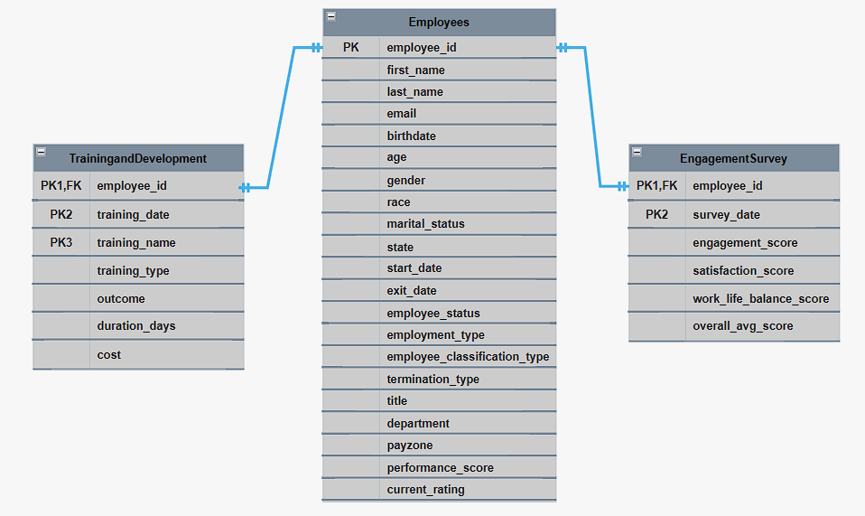
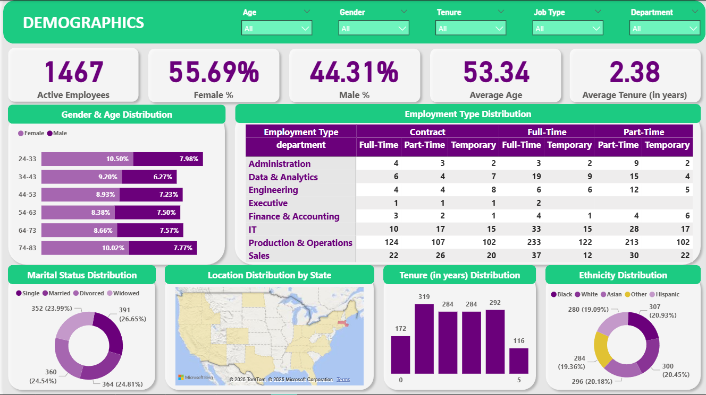

# HR-Analysis-and-Dashboard

## Project Overview

This project implements a comprehensive HR Analytics data pipeline using SQL Server, following a medallion architecture (Bronze → Silver → Gold) to transform raw HR data into analysis-ready datasets. The pipeline processes employee information, engagement surveys, and training data through multiple layers of validation and transformation.

To reach out raw datasets used in this project please click [here](data/raw/)

## Project Architecture

### Medallion Architecture Layers

##### Bronze Layer (Raw Data)

* Raw data ingestion from CSV files

* Minimal processing, preserving original data structure

* Serves as the source of truth for all transformations

The SQL definitions for creating Bronze layer tables are available in [here](scripts/bronze/ddl_bronze.sql)

SQL queries for loading raw source data into the Bronze layer can be found in [here](scripts/bronze/bronze_load_process.sql)

##### Silver Layer (Cleaned & Transformed)

* Data cleaning and standardization

* Type conversions and business rule applications

* Calculated fields and data quality improvements
  
* Filtered datasets based on business logic

The SQL definitions for creating Silver layer tables can be found in [here](scripts/silver/ddl_silver.sql)

The transformation logic that refines Bronze data into the Silver layer is outlined in [here](scripts/silver/silver_load_process.sql)
  
##### Gold Layer (Analytics-Ready)

* Business-ready views for reporting and analytics

* Standardized schema for downstream consumption

* Optimized for dashboard and BI tool integration

The SQL definitions for creating Gold layer analytics-ready views are available in [here](scripts/gold/ddl_gold.sql)

## Data Model Structure

The HR Analytics data model follows an employee-centric design with:

* **Employees:** Central employee table containing comprehensive employee information including personal details, employment status, organizational hierarchy, and performance metrics

* **EngagementSurvey:** Employee engagement data capturing survey responses and satisfaction metrics

* **TrainingandDevelopment:** Training participation records with outcomes, costs, and program details

Key relationships:

Each engagement survey record in **EngagementSurvey** references an employee through `employee_id`

Each training record in **TrainingandDevelopment** references an employee through `employee_id`

The Employees table serves as the central hub, enabling analysis of employee engagement and development patterns

Composite primary keys in EngagementSurvey (`employee_id`, `survey_date`) and TrainingandDevelopment (`employee_id`, `training_date`, `training_name`) support multiple records per employee over time

You can find detailed information about the tables and their contents [here](docs/data_catalog.md).

## Data Quality and Validation

Comprehensive data quality checks are implemented across both silver and gold layers to ensure data integrity and business rule compliance. The validation framework includes primary key uniqueness verification, referential integrity checks between employee and related records, cross-field consistency validation (age calculation, employment date logic), business rule enforcement (email format, performance score alignment, employment status consistency), and temporal validation ensuring survey and training dates fall within employment periods. These quality assurance measures guarantee high data accuracy and reliability
throughout the pipeline for trustworthy HR analytics.

The data quality and integrity checks for the Silver layer are implemented in [here](tests/quality_check_silver.sql)

The final data quality and integrity checks for the Gold layer are implemented in [here](tests/quality_check_gold.sql)

After all these procedures performed in SQL, you can find the cleaned data sets [here](data/clean).

## Analytics and Insights

The Power BI analytics implementation delivers end-to-end workforce intelligence through interactive dashboards. Insights and recommendations cover:

* **👥 Employee Demographics & Diversity:** Interactive breakdown of age, gender, tenure, job type, and ethnicity across departments to identify workforce composition and diversity gaps.

* **📊 Engagement & Satisfaction Insights:** Real-time tracking of employee engagement, satisfaction, and work-life balance scores by department, position, age, and tenure to highlight retention risks.

* **🧑‍🏫 Training Effectiveness & ROI:** Analysis of training participation, success rates, and cost-efficiency across departments and training types to optimize learning investments.

* **📈 Hiring & Turnover Trends:** Annual trends in hires, exits, and turnover rates by department and position, alongside performance ratings to support workforce planning.

To examine and download full interactive dashboard click [here](hr_dashboard.pbix)

## Overview

The HR analytics reveals a comprehensive workforce dataset spanning 2018-2023, encompassing 3,000 total employees with 1,533 departures over this six-year period and 1,467 currently active staff members. The organization shows an average employee performance rating of 2.97 out of 5 across the workforce, while investing $939.87K in training programs between August 2022-2023, demonstrating commitment to workforce development. Employee status breakdown shows 48.9% active employees, with departures split between voluntary terminations (768 employees, 25.6%), involuntary terminations (388 employees, 12.93%), and retirements (377 employees, 12.57%), while Production Technician roles (I and II) dominate headcount at 1,837 positions, and payroll distributed across three zones with Zone A accounting for the largest share at varying tenure levels.

## Employee Demographics & Diversity

* **Gender and Age Composition:** The active workforce of 1,467 employees shows a female majority at 55.69% compared to 44.31% male, with an average age of 53.34 years and 2.38 years average tenure. The age distribution reveals the largest concentration in the 24-83 bracket (10.50% female, 7.98% male), followed by the 74-83 group (10.02% female, 7.77% male), indicating a workforce spanning multiple generations with significant representation of both younger and senior employees.

* **Employment Structure and Departmental Breakdown:** Production & Operations dominates with 1,003 employees across all employment types (333 contract , 365 full-time, 315 part-time), representing nearly 70% of the workforce. IT follows with 125 total employees showing diverse contract arrangements, while Sales maintains 169 employees with balanced full-time and part-time positions, reflecting the organization's operational focus with supporting professional services.

* **Marital Status and Personal Demographics:** The workforce exhibits diverse family situations with single employees leading at 391 (26.65%), closely followed by married at 364 (24.81%), divorced at 360 (24.54%), and widowed at 352 (23.99%), demonstrating near-equal representation across all marital categories and suggesting inclusive employment practices for all life stages.

* **Tenure and Experience Profile:** Employee tenure distribution shows the highest concentration in the 1-4 year ranges (284-319 employees each), with newer employees (0 years: 172) and long-term veterans (5+ years: 116) representing smaller but significant portions, indicating successful recent hiring initiatives while maintaining an experienced core workforce.

* **Geographic Concentration and Ethnic Diversity:** The organization maintains strong geographic focus in Massachusetts while achieving exceptional ethnic balance with Black (20.45%), White (20.93%), Hispanic (19.09%), Asian (20.18%), and Other (19.36%) employees nearly equally represented, demonstrating successful diversity and inclusion initiatives across all ethnic groups with no single demographic dominating the workforce composition.

