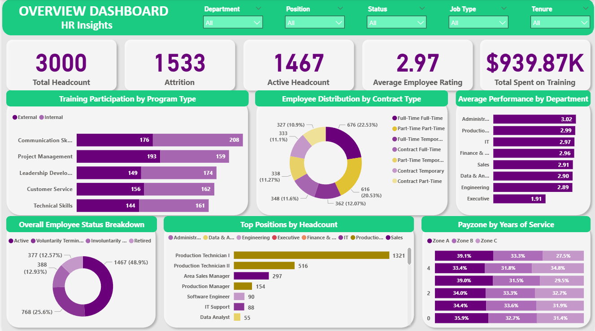
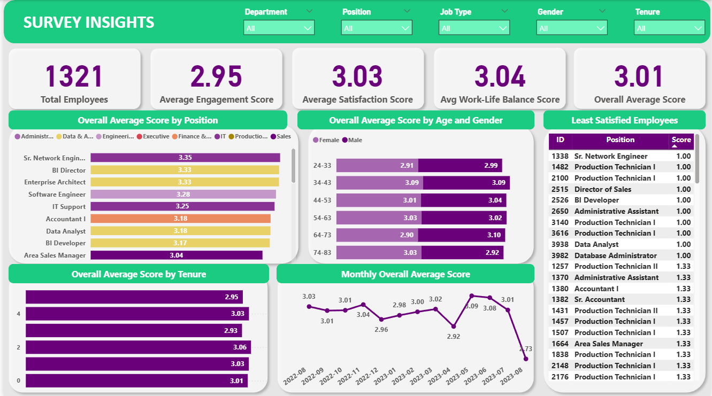
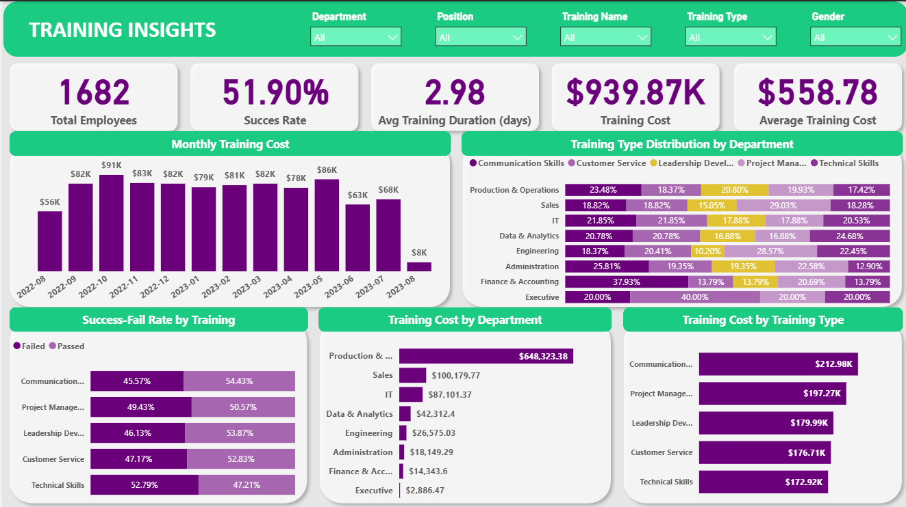
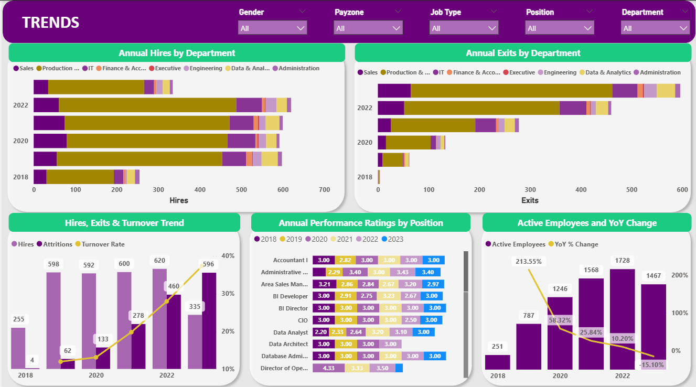

# HR-Analysis-and-Dashboard

## Project Overview

This project implements a comprehensive HR Analytics data pipeline using SQL Server, following a medallion architecture (Bronze → Silver → Gold) to transform raw HR data into analysis-ready datasets. The pipeline processes employee information, engagement surveys, and training data through multiple layers of validation and transformation.

To reach out raw datasets used in this project please click [here](data/raw/)

## Project Architecture

### Medallion Architecture Layers

##### Bronze Layer (Raw Data)

* Raw data ingestion from CSV files

* Minimal processing, preserving original data structure

* Serves as the source of truth for all transformations

The SQL definitions for creating Bronze layer tables are available in [here](scripts/bronze/ddl_bronze.sql)

SQL queries for loading raw source data into the Bronze layer can be found in [here](scripts/bronze/bronze_load_process.sql)

##### Silver Layer (Cleaned & Transformed)

* Data cleaning and standardization

* Type conversions and business rule applications

* Calculated fields and data quality improvements
  
* Filtered datasets based on business logic

The SQL definitions for creating Silver layer tables can be found in [here](scripts/silver/ddl_silver.sql)

The transformation logic that refines Bronze data into the Silver layer is outlined in [here](scripts/silver/silver_load_process.sql)
  
##### Gold Layer (Analytics-Ready)

* Business-ready views for reporting and analytics

* Standardized schema for downstream consumption

* Optimized for dashboard and BI tool integration

The SQL definitions for creating Gold layer analytics-ready views are available in [here](scripts/gold/ddl_gold.sql)

## Data Model Structure

The HR Analytics data model follows an employee-centric design with:

* **Employees:** Central employee table containing comprehensive employee information including personal details, employment status, organizational hierarchy, and performance metrics

* **EngagementSurvey:** Employee engagement data capturing survey responses and satisfaction metrics

* **TrainingandDevelopment:** Training participation records with outcomes, costs, and program details

Key relationships:

Each engagement survey record in **EngagementSurvey** references an employee through `employee_id`

Each training record in **TrainingandDevelopment** references an employee through `employee_id`

The Employees table serves as the central hub, enabling analysis of employee engagement and development patterns

Composite primary keys in EngagementSurvey (`employee_id`, `survey_date`) and TrainingandDevelopment (`employee_id`, `training_date`, `training_name`) support multiple records per employee over time

You can find detailed information about the tables and their contents [here](docs/data_catalog.md).

## Data Quality and Validation

Comprehensive data quality checks are implemented across both silver and gold layers to ensure data integrity and business rule compliance. The validation framework includes primary key uniqueness verification, referential integrity checks between employee and related records, cross-field consistency validation (age calculation, employment date logic), business rule enforcement (email format, performance score alignment, employment status consistency), and temporal validation ensuring survey and training dates fall within employment periods. These quality assurance measures guarantee high data accuracy and reliability
throughout the pipeline for trustworthy HR analytics.

The data quality and integrity checks for the Silver layer are implemented in [here](tests/quality_check_silver.sql)

The final data quality and integrity checks for the Gold layer are implemented in [here](tests/quality_check_gold.sql)

After all these procedures performed in SQL, you can find the cleaned data sets [here](data/clean).

## Analytics and Insights

The Power BI analytics implementation delivers end-to-end workforce intelligence through interactive dashboards. Insights and recommendations cover:

* **👥 Employee Demographics & Diversity:** Interactive breakdown of age, gender, tenure, job type, and ethnicity across departments to identify workforce composition and diversity gaps.

* **📊 Employee Engagement & Satisfaction:** Real-time tracking of employee engagement, satisfaction, and work-life balance scores by department, position, age, and tenure to highlight retention risks.

* **🧑‍🏫 Training Effectiveness & ROI:** Analysis of training participation, success rates, and cost-efficiency across departments and training types to optimize learning investments.

* **📈 Hiring & Turnover Trends:** Annual trends in hires, exits, and turnover rates by department and position, alongside performance ratings to support workforce planning.

To examine and download full interactive dashboard click [here](hr_dashboard.pbix)

## Overview

The HR analytics reveals a comprehensive workforce dataset spanning 2018-2023, encompassing 3,000 total employees with 1,533 departures over this six-year period and 1,467 currently active staff members. The organization shows an average employee performance rating of 2.97 out of 5 across the workforce, while investing $939.87K in training programs between August 2022-2023, demonstrating commitment to workforce development. Employee status breakdown shows 48.9% active employees, with departures split between voluntary terminations (768 employees, 25.6%), involuntary terminations (388 employees, 12.93%), and retirements (377 employees, 12.57%), while Production Technician roles (I and II) dominate headcount at 1,837 positions, and payroll distributed across three zones with Zone A accounting for the largest share at varying tenure levels.

## Employee Demographics & Diversity

* **Gender and Age Composition:** The active workforce of 1,467 employees shows a female majority at 55.69% compared to 44.31% male, with an average age of 53.34 years and 2.38 years average tenure. The age distribution reveals the largest concentration in the 24-83 bracket (10.50% female, 7.98% male), followed by the 74-83 group (10.02% female, 7.77% male), indicating a workforce spanning multiple generations with significant representation of both younger and senior employees.

* **Employment Structure and Departmental Breakdown:** Production & Operations dominates with 1,003 employees across all employment types (333 contract , 365 full-time, 315 part-time), representing nearly 70% of the workforce. IT follows with 125 total employees showing diverse contract arrangements, while Sales maintains 169 employees with balanced full-time and part-time positions, reflecting the organization's operational focus with supporting professional services.

* **Marital Status and Personal Demographics:** The workforce exhibits diverse family situations with single employees leading at 391 (26.65%), closely followed by married at 364 (24.81%), divorced at 360 (24.54%), and widowed at 352 (23.99%), demonstrating near-equal representation across all marital categories and suggesting inclusive employment practices for all life stages.

* **Tenure and Experience Profile:** Employee tenure distribution shows the highest concentration in the 1-4 year ranges (284-319 employees each), with newer employees (0 years: 172) and long-term veterans (5+ years: 116) representing smaller but significant portions, indicating successful recent hiring initiatives while maintaining an experienced core workforce.

* **Geographic Concentration and Ethnic Diversity:** The organization maintains strong geographic focus in Massachusetts while achieving exceptional ethnic balance with Black (20.45%), White (20.93%), Hispanic (19.09%), Asian (20.18%), and Other (19.36%) employees nearly equally represented, demonstrating successful diversity and inclusion initiatives across all ethnic groups with no single demographic dominating the workforce composition.

## Employee Engagement & Satisfaction

* **Overall Performance Metrics:** The comprehensive employee survey conducted between August 2022-2023 across 1,321 employees reveals moderate satisfaction levels with an overall average score of 3.01 out of 5. Key performance indicators show average engagement at 2.95, satisfaction at 3.03, and work-life balance at 3.04, indicating room for improvement across all dimensions while maintaining consistent performance standards organization-wide.

* **Position-Based Performance Variations:** Senior Network Engineers lead with the highest satisfaction score at 3.35, followed by BI Directors and Enterprise Architects at 3.33, while Software Engineering Managers (2.44) and IT Directors (2.50) show the lowest satisfaction scores. Some technical and analytical roles outperform operational positions, with IT Support (3.25) and Data Analysts (3.18) showing above-average satisfaction, though management-level technical positions demonstrate concerning satisfaction gaps.

* **Demographic and Tenure Analysis:** Age and gender analysis reveals females in the 34-43 bracket achieving the highest satisfaction (3.09), while the 64-73 female group shows the lowest (2.90). Tenure-based scores indicate optimal satisfaction at 2 years (3.06) with gradual decline in longer-tenured employees, suggesting potential challenges in long-term employee retention and career development progression.

* **Critical Satisfaction Concerns:** The analysis identifies 103 active employees with critically low satisfaction scores below 2.0, predominantly concentrated in Production Technician I and II roles, followed by Area Sales Managers. Monthly trends show volatility with peaks in May 2023 (3.09) and significant drops in August 2023 (2.73), indicating potential seasonal or operational factors affecting employee satisfaction and requiring immediate management attention for these high-risk employee segments.

## Training Effectiveness & ROI

* **Training Program Overview:** Between August 2022-2023, the organization conducted comprehensive training initiatives engaging 1,682 participants (including both active and former employees during this period) with a total investment of $939.87K and an average cost of $558.78 per training. The program achieved a moderate 51.90% success rate with an average training duration of 2.98 days, indicating substantial commitment to workforce development despite mixed completion outcomes.
  
* **Training Performance and Success Rates:** Technical Skills training shows the lowest success rate at 47.21% compared to 52.79% failure rate, while Communication Skills achieves the highest success rate at 54.43%. Project Management (50.57%), Leadership Development (53.87%), and Customer Service (52.83%) maintain moderate success rates, suggesting the need for enhanced program design and delivery methods, particularly for technical competency development.

* **Financial Investment and Resource Allocation:** Production & Operations receives the largest training investment at $648,323.38, reflecting the department's size and operational importance, followed by Sales ($100,179.77) and IT ($87,101.37). By training type, Communication Skills commands the highest investment at $212.98K, followed by Project Management ($197.27K) and Leadership Development ($179.99K), demonstrating strategic focus on soft skills and management capabilities.

* **Departmental Training Distribution:** Finance & Accounting leads in Communication Skills training with the highest participation rate at 37.93%, while Sales demonstrates strong focus on Project Management (29.03%) and Engineering shows the highest engagement in Project Management training (28.57%). Data & Analytics achieves the highest Technical Skills participation (24.68%), and Executive level shows significant emphasis on Customer Service training (40.00%) with balanced distribution across other programs, indicating tailored training approaches aligned with departmental functions and strategic priorities.

## Hiring & Turnover Trends

* **Workforce Growth and Attrition Patterns:** The organization experienced significant workforce expansion from 2018-2022, with hiring peaking at 620 employees in 2021 and declining to 335 in 2023, while exits steadily escalated from just 4 departures in 2018 to 596 in 2023. The turnover rate showed concerning upward trajectory, rising from 11.95% in 2019 to 37.31% in 2023, indicating increasing workforce instability despite continued hiring efforts, with the most dramatic acceleration occurring after 2021 when exits (460) began approaching hire levels (620).

* **Departmental Hiring and Exit Analysis:** Production & Operations dominates both hiring and exit volumes across all years, reflecting the department's operational scale and higher turnover nature. Sales shows consistent hiring activity but proportionally lower exit rates, while IT, Data & Analytics, and other professional departments maintain steady but smaller-scale hiring patterns with relatively controlled attrition levels throughout the analyzed period.

* **Active Employee Trends and Growth Trajectory:** Active employee count grew substantially from 251 in 2018 to peak at 1,728 in 2022 before declining to 1,467 in 2023 (-15.20% decline). The most dramatic expansion occurred in 2019 with 213.55% growth, followed by continued strong growth of 58.32% in 2020 and 25.84% in 2021, with growth moderating to 10.20% in 2022 before the workforce contraction in 2023, suggesting rapid scaling followed by strategic rightsizing aligned with changing business requirements and market conditions.

* **Performance Rating Variability and Position-Based Analysis:** Annual performance ratings demonstrate significant inconsistency across positions and years, with notable volatility in leadership and management roles from 2018-2023. Critical exceptions include Director of Sales fluctuating dramatically from 1.00 to 4.00, IT Director ranging from 1.67 to 5.00, and President & CEO showing concerning performance decline from 2.40 to 1.00, while technical senior roles (BI Director, CIO, Senior BI Developer) maintain more stable 3.00 ratings, indicating inconsistent performance management practices with concerning leadership instability requiring immediate organizational intervention and evaluation process standardization.

## Recommendations

* Implement immediate **performance improvement plans** for executive roles showing concerning volatility, particularly the **President & CEO** (declining from 2.40 to 1.00), **Director of Sales** (1.00-4.00 fluctuation), and **IT Director** (1.67-5.00 range) to restore organizational stability

* Address the **alarming 37.31% turnover rate in 2023** through comprehensive retention strategy including exit interviews for **596 departures**, compensation review, and retention bonuses for critical roles

* **Standardize performance evaluation process** to eliminate significant rating inconsistencies across positions and years through calibration sessions, manager training, and quarterly review cycles

* Target **103 employees with satisfaction scores below 2.0** who represent high flight risks through immediate intervention programs and **personalized retention strategies**

* **Overhaul training programs** to address the critically low **51.90% overall success rate** and particularly the **47.21% Technical Skills failure rate** by extending training duration beyond the insufficient **2.98-day average**, implementing mentorship programs, and redesigning curriculum for complex skill acquisition requiring **$939.87K investment optimization**

* **Improve employee performance and satisfaction metrics** from concerning levels including **2.97/5 average performance rating** and **3.01/5 satisfaction score** through targeted interventions for underperforming roles like **Software Engineering Managers (2.44)** and enhanced work-life balance initiatives

* Implement **department-specific retention strategies** for **Production & Operations** representing **70% of workforce (1,003 employees)** including career progression pathways for **Production Technicians I and II**

* Develop **strategic workforce planning** to manage dramatic fluctuations from **251 employees (2018) to 1,728 (2022) to 1,467 (2023)** through demand forecasting and flexible staffing strategies

* Expand **Leadership Development investment** beyond current **$179.99K** to include more senior and middle management positions, particularly in departments with high turnover and low satisfaction scores

* Address **satisfaction decline in longer-tenured employees** by implementing career development programs and addressing the **optimal satisfaction at 2 years** before gradual decline

* **Maintain exceptional ethnic diversity** across all groups **(19-21% representation)** through continued inclusive hiring practices and cultural competency training

* Implement **monthly HR analytics reviews** and **predictive turnover modeling** to proactively identify at-risk employees before issues escalate to departure

* Address **seasonal satisfaction volatility** from peaks in **May 2023 (3.09)** to drops in **August 2023 (2.73)** through operational factor analysis and management intervention

* **Leverage diverse marital status representation** (single 26.65%, married 24.81%, divorced 24.54%, widowed 23.99%) to develop inclusive benefit packages for all life stages

